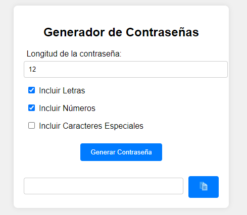

# Generador de Contraseñas Seguras

Este es un simple generador de contraseñas seguras creado con HTML, CSS y JavaScript. Permite a los usuarios seleccionar la longitud de la contraseña y qué tipos de caracteres incluir. También incluye una funcionalidad para copiar la contraseña generada al portapapeles con un mensaje de confirmación.

## Características

- Selección de longitud de la contraseña.
- Inclusión opcional de letras, números y caracteres especiales.
- Botón para copiar la contraseña generada.
- Mensaje de confirmación temporal cuando se copia la contraseña.

## Captura de Pantalla

## Estructura del Proyecto

El proyecto consta de los siguientes archivos:

1. `index.html`: Estructura HTML del generador de contraseñas.
2. `styles.css`: Estilos CSS para el diseño del generador.
3. `script.js`: Lógica JavaScript para la generación de contraseñas y funcionalidad de copia.

## Uso

1. Clona el repositorio o descarga los archivos.
2. Abre `index.html` en tu navegador.
3. Selecciona las opciones deseadas para la contraseña.
4. Haz clic en "Generar Contraseña".
5. Copia la contraseña generada usando el botón de copiar.

## Código

### HTML (`index.html`)
